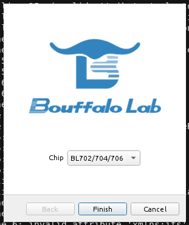

## Sipeed M0Sense notes

This is a personal repo to keep notes on how to code the [M0Sense](https://wiki.sipeed.com/hardware/en/maixzero/sense/maix_zero_sense.html) board.

Start board with GPIO pin 28 high to enter "programming" mode.

Download "Bouffalo Lab Dev Cube" from https://dev.bouffalolab.com/download and upload the default firmware available at https://dl.sipeed.com/shareURL/Maix-Zero/M0sense/7_Example_demos/default_firmware



```
./setup.sh
./build.sh blink
./serial.sh
```